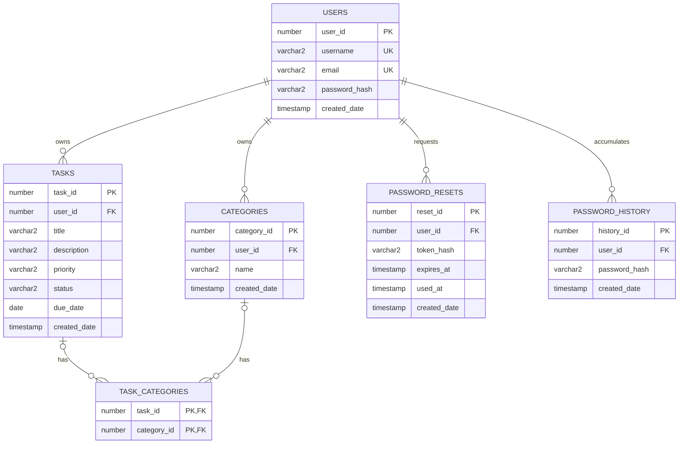

# Smart Task Manager — Entity Relationship Description

## Entities

### USERS
| Attribute | Type | Key | Notes |
|---|---|---|---|
| user_id | NUMBER | PK | identity |
| username | VARCHAR2(100) | UK | NOT NULL, UNIQUE |
| email | VARCHAR2(255) | UK | NOT NULL, UNIQUE |
| password_hash | VARCHAR2(255) | | NOT NULL |
| created_date | TIMESTAMP | | NOT NULL |

### CATEGORIES
| Attribute | Type | Key | Notes |
|---|---|---|---|
| category_id | NUMBER | PK | identity |
| user_id | NUMBER | FK -> USERS.user_id | NOT NULL |
| name | VARCHAR2(100) | UK (composite w/ user_id) | NOT NULL |
| created_date | TIMESTAMP | | NOT NULL |

### TASKS
| Attribute | Type | Key | Notes |
|---|---|---|---|
| task_id | NUMBER | PK | identity |
| user_id | NUMBER | FK -> USERS.user_id | NOT NULL |
| title | VARCHAR2(200) | | NOT NULL |
| description | VARCHAR2(4000) | | nullable |
| priority | VARCHAR2(10) | | NOT NULL, CHECK (High/Medium/Low) |
| status | VARCHAR2(20) | | NOT NULL, CHECK (Pending/In Progress/Completed/Cancelled) |
| due_date | DATE | | NOT NULL |
| created_date | TIMESTAMP | | NOT NULL |

### TASK_CATEGORIES
| Attribute | Type | Key | Notes |
|---|---|---|---|
| task_id | NUMBER | PK (composite), FK -> TASKS.task_id | |
| category_id | NUMBER | PK (composite), FK -> CATEGORIES.category_id | |

Junction table for the many-to-many task↔category relationship. Replaced the
original `tasks.category_id` single-FK column (see Migration History below).

### PASSWORD_RESETS
| Attribute | Type | Key | Notes |
|---|---|---|---|
| reset_id | NUMBER | PK | identity |
| user_id | NUMBER | FK -> USERS.user_id | NOT NULL |
| token_hash | VARCHAR2(255) | | NOT NULL, SHA-256 hash of the reset token |
| expires_at | TIMESTAMP | | NOT NULL |
| used_at | TIMESTAMP | | nullable |
| created_date | TIMESTAMP | | NOT NULL |

### PASSWORD_HISTORY
| Attribute | Type | Key | Notes |
|---|---|---|---|
| history_id | NUMBER | PK | identity |
| user_id | NUMBER | FK -> USERS.user_id | NOT NULL |
| password_hash | VARCHAR2(255) | | NOT NULL |
| created_date | TIMESTAMP | | NOT NULL |

Stores the last several bcrypt hashes per user so a password reset/change can
reject reuse of a recent password.

## Relationships

**USERS -> TASKS: One-to-Many, non-identifying, mandatory child.**
Each USER may own zero, one, or many TASKS. Each TASK must belong to exactly one USER — `tasks.user_id` is `NOT NULL`, so a task cannot exist without an owning user. Non-identifying because `task_id` is its own surrogate key, not a composite that includes `user_id`. Enforced by `fk_tasks_user` (`ON DELETE CASCADE` — deleting a user deletes their tasks).
Cardinality: 1 : 0..N

**USERS -> CATEGORIES: One-to-Many, non-identifying, mandatory child.**
Each USER may own zero, one, or many CATEGORIES. Each CATEGORY must belong to exactly one USER (`categories.user_id NOT NULL`). Enforced by `fk_categories_user` (`ON DELETE CASCADE`).
Cardinality: 1 : 0..N

**TASKS <-> CATEGORIES: Many-to-Many, via TASK_CATEGORIES.**
A TASK may have zero, one, or many CATEGORIES; a CATEGORY may be assigned to zero, one, or many TASKS. Both FKs on the junction table are `ON DELETE CASCADE`: deleting a task removes its category associations (not the categories themselves), and deleting a category removes it from any tasks that had it (not the tasks themselves).
Cardinality: 0..N : 0..N

**USERS -> PASSWORD_RESETS: One-to-Many, non-identifying, mandatory child.**
Each USER may have zero, one, or many reset tokens over time (a new request invalidates prior unused ones). Enforced by `fk_password_resets_user` (`ON DELETE CASCADE`).
Cardinality: 1 : 0..N

**USERS -> PASSWORD_HISTORY: One-to-Many, non-identifying, mandatory child.**
Each USER accumulates one history row per password set (register, reset, or change), pruned to the most recent 5. Enforced by `fk_password_history_user` (`ON DELETE CASCADE`).
Cardinality: 1 : 0..N

## Mermaid ER syntax

Paste into draw.io via Extras -> Edit Diagram, or any Mermaid renderer.

## Notes for SQL Developer Data Modeler

The table above (entity/attribute/PK/FK) maps directly onto its logical/relational model entry screens — create the entities, set PKs, then draw the mandatory 1:N relationships (USERS-TASKS, USERS-CATEGORIES, USERS-PASSWORD_RESETS, USERS-PASSWORD_HISTORY) and the TASKS<->CATEGORIES many-to-many via the TASK_CATEGORIES junction/associative entity.

## Migration history

This ERD reflects the schema after all of `db/migrations/` (`V1`-`V8`) has been
applied. Notable changes along the way:
- `V5` renamed `users.name` to `users.username` and added a unique constraint.
- `V6`/`V7` added `PASSWORD_RESETS`/`PASSWORD_HISTORY` for the forgot/reset-password flow.
- `V8` replaced the original single `tasks.category_id` FK with the `TASK_CATEGORIES`
  junction table (many-to-many), migrating existing data across before dropping the column.

`ERD.png` was generated from an earlier version of this diagram (pre-`V5`) and is now
stale; regenerate it from the Mermaid source above if a rendered image is needed.
