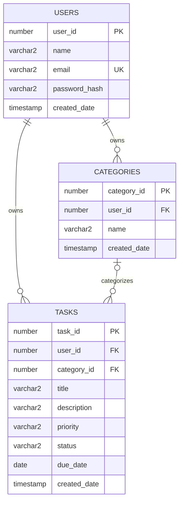

# Smart Task Manager — Entity Relationship Description

## Entities

### USERS
| Attribute | Type | Key | Notes |
|---|---|---|---|
| user_id | NUMBER | PK | identity |
| name | VARCHAR2(100) | | NOT NULL |
| email | VARCHAR2(255) | UK | NOT NULL, UNIQUE |
| password_hash | VARCHAR2(255) | | NOT NULL |
| created_date | TIMESTAMP | | NOT NULL |

### CATEGORIES
| Attribute | Type | Key | Notes |
|---|---|---|---|
| category_id | NUMBER | PK | identity |
| user_id | NUMBER | FK -> USERS.user_id | NOT NULL |
| name | VARCHAR2(100) | UK (composite w/ user_id) | NOT NULL |
| created_date | TIMESTAMP | | NOT NULL |

### TASKS
| Attribute | Type | Key | Notes |
|---|---|---|---|
| task_id | NUMBER | PK | identity |
| user_id | NUMBER | FK -> USERS.user_id | NOT NULL |
| category_id | NUMBER | FK -> CATEGORIES.category_id | nullable |
| title | VARCHAR2(200) | | NOT NULL |
| description | VARCHAR2(4000) | | nullable |
| priority | VARCHAR2(10) | | NOT NULL, CHECK (High/Medium/Low) |
| status | VARCHAR2(20) | | NOT NULL, CHECK (Pending/In Progress/Completed/Cancelled) |
| due_date | DATE | | NOT NULL |
| created_date | TIMESTAMP | | NOT NULL |

## Relationships

**USERS -> TASKS: One-to-Many, non-identifying, mandatory child.**
Each USER may own zero, one, or many TASKS. Each TASK must belong to exactly one USER — `tasks.user_id` is `NOT NULL`, so a task cannot exist without an owning user. Non-identifying because `task_id` is its own surrogate key, not a composite that includes `user_id`. Enforced by `fk_tasks_user` (`ON DELETE CASCADE` — deleting a user deletes their tasks).
Cardinality: 1 : 0..N

**USERS -> CATEGORIES: One-to-Many, non-identifying, mandatory child.**
Each USER may own zero, one, or many CATEGORIES. Each CATEGORY must belong to exactly one USER (`categories.user_id NOT NULL`). Enforced by `fk_categories_user` (`ON DELETE CASCADE`).
Cardinality: 1 : 0..N

**CATEGORIES -> TASKS: One-to-Many, non-identifying, optional child.**
Each CATEGORY may be assigned to zero, one, or many TASKS. Each TASK may belong to zero or one CATEGORY (`tasks.category_id` is nullable — a task can be uncategorized). Enforced by `fk_tasks_category` (`ON DELETE SET NULL`).
Cardinality: 1 : 0..N, optional on both ends of the FK column itself.

## Mermaid ER syntax

Paste into draw.io via Extras -> Edit Diagram, or any Mermaid renderer.

## Notes for SQL Developer Data Modeler

The table above (entity/attribute/PK/FK) maps directly onto its logical/relational model entry screens — create the three entities, set PKs, then draw the two mandatory 1:N relationships (USERS-TASKS, USERS-CATEGORIES) and the one optional 1:N (CATEGORIES-TASKS), toggling "Mandatory" off on the CATEGORIES side of that last one.
